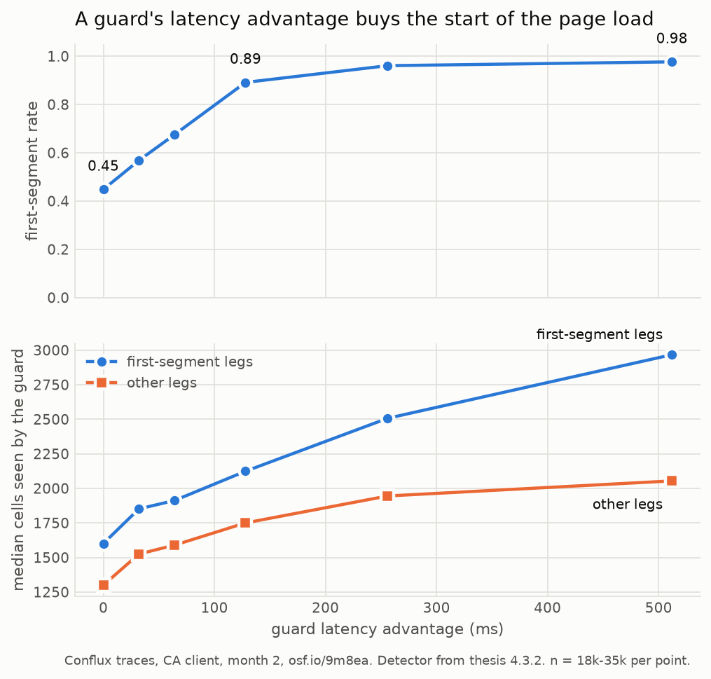
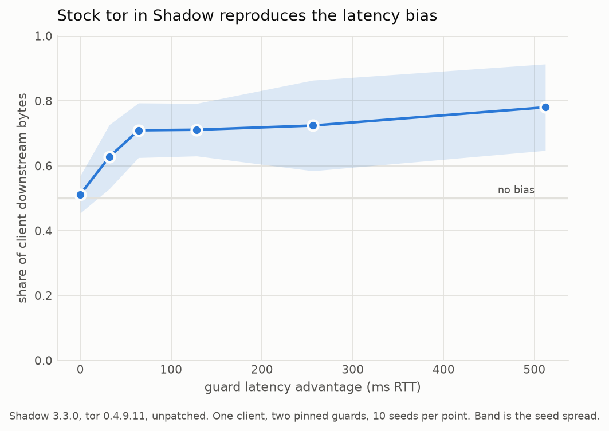
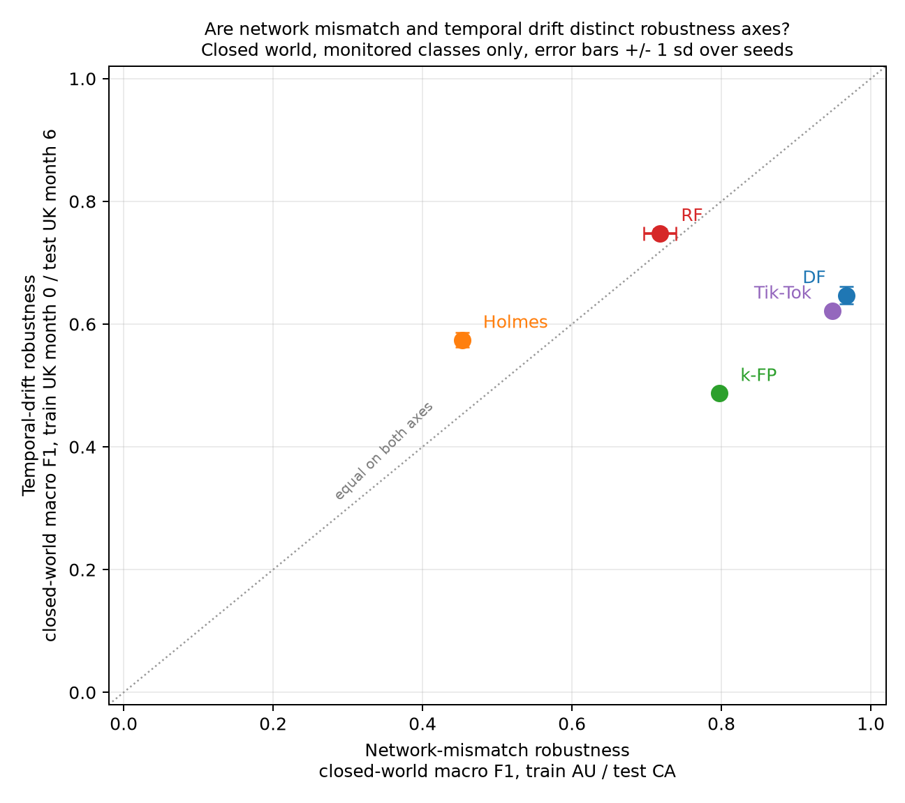

# tor-wf-lab

Two investigations into Tor website fingerprinting, run against Shadbeh, Khajavi
& Wang, *Reality Check for Tor Website Fingerprinting in the Open World*
(arXiv:2603.07412). One asks whether two kinds of classifier robustness are
really distinct properties. The other asks whether a guard relay can buy itself
a better view of your browsing by being fast, and whether Tor could stop it.

Both are finished. Everything that could not be measured is labelled as such.
`make` rebuilds the Track B measurements and figures and the k-FP numbers from
open data, end to end; the four CNN classifiers need a GPU and the Shadow
simulation needs Shadow, and both have their own runbooks. `make help` says
which is which.

---

## Can a guard buy the start of your page load?

Yes, and cheaply. Tor's Conflux splits a page load across two circuits, and the
default LowRTT scheduler sends to whichever leg has the lowest round-trip time.
A guard that makes itself look 128 ms closer goes from owning the feature-rich
start of a load 45% of the time to owning it 89% of the time.



That is measured on the authors' own released Conflux traces, using their own
published detector, and two independent checks back it. The detector scores
exactly 1.0000 on non-Conflux control traces, where every load has one leg and
so must be a first segment. Separately, and without using the detector at all,
counting cells against the single-leg control median of 4,542 reproduces their
"about 65% of traces hold less than half a load" claim at 0.659; that one is
derived by hand in
[`track-b-conflux/notes/06-fs-kill-test.md`](track-b-conflux/notes/06-fs-kill-test.md)
rather than emitted by a script.

Unpatched tor 0.4.9.11 in the Shadow simulator shows the same bias from the
other direction: two identical guards split a download 0.512 / 0.488, a coin
flip, and one advantaged guard takes 0.71 of it by 64 ms.



**What it is worth, measured rather than assumed:** k-FP classifies 74% of the
traces where the guard owns the first segment, against 37% of the rest. A 128 ms
advantage multiplies *how often* the guard wins the start by 1.97 and its
accuracy on the traces it wins by only 1.19. Ownership is the attack. (Both
figures are measured on k-FP's held-out split, restricted to the 107 classes
present in all six conditions; the 0.448 -> 0.891 rates quoted above are for the
whole collection, where the same multiplier is 1.99.)

**So the fix is small.** If ownership is the whole attack, the code to change is
the initial leg choice, one function at `conflux.c:600`. Holding the measured
conditionals fixed and pinning ownership back to its no-advantage rate flattens
the curve: a 512 ms advantage would be worth 0.537 instead of 0.891, and at most
about +0.05 anywhere on the sweep. Buying latency stops paying.

Verdict, reasoning and the two kill conditions: **[`docs/track-b-memo.md`](docs/track-b-memo.md)**.

Incidental finding along the way: `CONFLUX_ALG_CWNDRTT`, the one scheduler in
Tor's tree designed to use both legs while bounding reordering, is implemented,
dispatched at `conflux.c:697`, and unreachable. No UX value maps to it.

---

## Are the two robustness axes really distinct?

Five classifiers, both axes, three seeds, closed world.



No classifier is good at both, so the hypothesis holds in its weaker form. The
stronger claim, that the axes are independent properties, rests almost entirely
on RF: it is the one classifier that inverts, fourth of five against network
mismatch and first against drift. Two are hurt more by changing country than by
ageing six months, RF (−0.250 against −0.221) and Holmes (−0.504 against
−0.403); the other three lose far more to drift. Two follow-ups, both below,
qualify that table heavily and limit what it can support.

**And the network axis is one country pair.** The thesis measures
network-mismatch robustness at a single point, train AU test CA. Across the four
ordered pairs the post-Conflux collections allow, that cell is the hardest of the
four for all five classifiers, unanimously, because the training vantage and the
target country each move degradation by roughly 2.5x to 3.5x and compound in that
one cell. RF's collapse is largely specific to it: 0.269 there against 0.026 to
0.074 on the other three.
`track-a-robustness/results/netpairs/summary.md`.

**Measured from one vantage, the grouping does not survive.** The thesis's two
axes do not share a training collection (Table 4.1 trains AU, Table 4.3 trains
UK), which entangles vantage with axis. Removing the confound shows that *which*
axis costs a classifier more is set by the training vantage and the target
country rather than by the classifier: of the four vantage-and-target cells
measured, only AU->CA yields any network-limited classifier at all (2 of 5), and
the other three yield none. What is invariant is the ordering by network
sensitivity relative to drift, RF < k-FP < Tik-Tok < DF, identical in all four
cells (pairwise Spearman 1.000).
`track-a-robustness/results/vantage/summary.md` and `results/vantage-uk/`.

**What this run cannot claim.** The open-world background set is behind a data
use agreement, so every number here is closed-world macro F1 and every number in
the paper is open-world F1 at a tuned threshold. Different measurements. The
drift column happens to land a mean absolute 0.008 from the published month-2
values, with a worst cell of 0.018, and the rank ordering matches theirs
exactly, but that is corroboration and is not reproduction. The brief's
"reproduce one paper number" gate is recorded as **unsatisfied**, because on
open data it cannot be satisfied.

Full verdict: **[`docs/track-a-robustness-axes.md`](docs/track-a-robustness-axes.md)**.

---

## Reproducing

```bash
make venv        # .venv plus the pinned analysis stack
make fs-figure   # end to end from nothing: fetch 1.7 GB, verify, measure, plot
make figures     # redraw every figure from the JSON already in results/
make help        # everything else
```

The traces are not in the repo. `make data` fetches all 10.6 GB from
`osf.io/9m8ea` and checks all 29 against the authors' sha512 lists; a bad
digest, an absent listing or an incomplete download fails the target rather than
being printed and passed over. Sizes here are decimal GB, matching what curl and
OSF report.

`make` covers Track B end to end and k-FP on both Track A axes. It does **not**
cover the four CNN classifiers, which need a GPU and their own runbook
(`track-a-robustness/RUNBOOK-5090.md`), or the Shadow experiment, which needs
Shadow, tgen and tor on PATH and lives in `track-b-conflux/shadow/`.

---

## Scope, and what was not done

| Track | Question | Status |
|---|---|---|
| A | Are network-mismatch and temporal-drift robustness distinct axes, with no classifier good at both? | Done. Five classifiers, 3 seeds, closed world. No classifier is good at both; the axes are distinct as an *ordering* but not as a categorisation, since which axis limits a classifier depends on the training vantage and the target country. Gate 3 unsatisfiable on open data |
| B | Is "Conflux scheduling that mitigates LowRTT latency bias" a viable multi-week project? | Done. Verdict go, narrowed. No Tor patch written, per the brief |

Not done, and deliberately: no Tor patches, no open-world numbers, and no claim
that any closed-world number here is comparable to a published one. Holmes was
originally out of scope, on the grounds that the thesis's Table C.1 is too thin
to reimplement faithfully; it came back in when the authors' own pipeline turned
out to be released as WFlib, so all five classifiers ran.

## Layout

```
prompts/                    the two briefs, verbatim, treated as read-only
track-a-robustness/
  src/                      fetch and verify, loaders, the five classifiers, runners, plot
  data/                     OSF traces, gitignored, 10.6 GB
  results/                  per-classifier JSON, generated tables, the scatter plot
    netpairs/               four country pairs, verdict section 4
    vantage/, vantage-uk/   both axes from each training vantage, section 5
  logs/                     deltas.md, paper-numbers.md, osf-inventory.md,
                            holmes-attr-coverage.md
  RUNBOOK-5090.md           what ran on the GPU box, and what it cost
track-b-conflux/
  notes/                    01-05 scoping, 06-07 measurement, 08-09 Shadow
  src/                      first-segment detector, the two trace measurements
  shadow/                   Shadow experiment generator, pcap analysis, sweep
  results/                  JSON and figures for both measurements and the sim
docs/                       the two finished writeups, plus correspondence/
```

## Reference material

- Paper: https://arxiv.org/abs/2603.07412
- Full text incl. Appendix A Table 7 (hyperparameters, needed by Track A step 2):
  SFU thesis version, freely downloadable,
  https://summit.sfu.ca/_flysystem/fedora/2026-04/etd24263.pdf
- Code and data: https://osf.io/9m8ea/
  Synthetic monitored traces are open. The real non-monitored (open-world
  background) set is behind a data use agreement.
- Tor proposal 329 (Track B): https://spec.torproject.org/proposals/329-traffic-splitting.html

Verified 2026-09-06: the paper, both mirrors and the arXiv identifier are real.

## Numbers from the paper this repo is trying to interrogate

Recorded here so a later run can be checked against them rather than against
memory. All quoted from the two briefs, not yet independently confirmed against
the PDF.

| Claim | Value |
|---|---|
| Best attack, real open world, 9% base rate | precision 0.956, recall 0.922 |
| RF, cross-network (train AU, test CA), Table 3 | F1 0.046 |
| RF, six-month concept drift, Table 5 | F1 0.754 |
| DF, cross-network, Table 3 | F1 0.939 |
| DF, six-month concept drift, Table 5 | F1 0.685 |
| DF under Conflux, guard sees one leg | F1 0.939 -> 0.379 |
| DF under Conflux, guard with 128ms latency advantage | TPR 0.189 -> 0.736 |

**Confirmed against the PDF on 2026-09-06.** All seven match the thesis exactly,
with no transcription error in the brief. The thesis numbers the tables
differently (brief Table 3 = thesis Table 4.1, brief Table 5 = thesis Table 4.3,
brief Appendix A Table 7 = thesis Appendix C Table C.1). Full check, both tables
in full, and the hyperparameter table:
`track-a-robustness/logs/paper-numbers.md`.

## Ground rules

Both briefs are explicit about these, and they apply to anything committed here:

- No invented numbers. A failed run or missing data gets written down as a
  failed run or missing data.
- Track A: do not retune hyperparameters. The point is comparing published
  configurations, so every deviation from Appendix A Table 7 goes in
  `track-a-robustness/logs/deltas.md`.
- Track A: minimum three seeds per cell, variance reported. Single-run numbers
  are the thing being complained about.
- Track B: no Tor patches. Scoping only, and a no-go is a perfectly good
  outcome.
- Assume no network access to DUA-gated data unless stated otherwise.

## Environment note

Track A's brief assumes a single RTX 5090 on Linux. There are two machines:

- **This one**, `owen-GR9`: Ubuntu 24.04.4 native, Ryzen 9 5900HX (16 threads),
  30 GB RAM, no CUDA GPU. Integrated AMD graphics only, and gfx90c is not a
  supported ROCm target, so it is CPU-only in practice.
- **The Windows box**, which has the 5090. Any run there needs WSL2 or the Linux
  install, and Blackwell sm_120 needs cu128 or newer wheels.

Division of labour that followed from that: staging, verification and k-FP on the
laptop; DF, Tik-Tok, RF and Holmes, all CNNs (Table C.1), on the 5090. The 5090
box turned out to have no WSL, so those ran on native Windows Python with
torch 2.11.0+cu128; capability `(12, 0)` and `sm_120` were confirmed before any
training. Whichever machine a result came from is recorded in `deltas.md`, along
with CUDA and torch versions.

Local setup on this machine: `.venv` (Python 3.12.3, numpy / scipy / sklearn /
matplotlib, no torch). Data lives in `track-a-robustness/data/`, gitignored.

## Open items

1. ~~Confirm the paper's table numbers against the PDF.~~ Done, all seven exact,
   see `track-a-robustness/logs/paper-numbers.md`.
2. ~~Inventory OSF.~~ Done, see `track-a-robustness/logs/osf-inventory.md`.
   Result: ~10.6 GB of monitored traces are open and span AU/CA/UK across month
   0/2/6, but the open-world background set is DUA-gated for one year post
   release and is not even listed. Both axes are runnable closed-world only.
3. ~~Stage the data.~~ Done. All 29 open `.npz` downloaded, 10.6 GB, all 29
   verified against the authors' sha512 lists (`src/verify_osf.py`).
4. ~~Decide: closed-world now, or request the DUA and wait.~~ Resolved by running
   it. Closed-world was the right call: the **rank ordering on both axes is
   reproduced exactly** (Spearman 1.000 against the published tables), so the
   two-axis question is answerable, even though cell values are not comparable
   and step 3 stays unsatisfiable. See `results/vs-paper.md`.
5. **Still open, but less costly than it looked.** The thesis authors' own code is
   still missing, and the email asking for it is written and unsent
   (`docs/correspondence/03-combined-request.md`). But the *original* classifier
   authors did release theirs, so RF and Holmes are transcriptions of
   `robust-fingerprinting/RF` and WFlib rather than guesses. Only DF, Tik-Tok
   and k-FP are reimplemented from paper text.
6. ~~The four CNNs need the 5090 machine.~~ Done, and Holmes ran too, making five
   classifiers rather than four. See `docs/track-a-robustness-axes.md`.
7. **Still open.** The DUA-gated background set, same email. There is **no
   platform route**: the OSF node reports `access_requests_enabled: true` but is
   public with zero child components, so OSF renders no "Request Access" control
   and the restricted data is absent rather than gated. Email is the only path.
   This is why the two earlier drafts merged into one.

## Where each result lives

Every headline above, with its full numbers, caveats and the code that produced
it.

| Result | Write-up | Numbers | Code |
|---|---|---|---|
| Five classifiers, both axes | `docs/track-a-robustness-axes.md` | `track-a-robustness/results/axes-table.md` | `track-a-robustness/src/run_torch.py` (DF, Tik-Tok, RF), `run_kfp.py`, `run_holmes.py`; plotted by `plot_axes.py` |
| Ours against the paper | same | `track-a-robustness/results/vs-paper.md` | `track-a-robustness/src/compare_to_paper.py` |
| RF slot-size sweep | same | `track-a-robustness/results/rf-slot-sweep.md` | `track-a-robustness/src/run_torch.py rf --slots 300 / --slots 150`, tabulated by `sweep_summary.py` |
| Four country pairs | `docs/track-a-robustness-axes.md` section 4 | `track-a-robustness/results/netpairs/summary.md` | `track-a-robustness/src/run_torch.py`, `run_kfp.py`, `run_holmes.py` with `--axes cross-network-post-au cross-network-post-uk`; tabulated by `netpair_summary.py` |
| Both axes from one vantage, twice | `docs/track-a-robustness-axes.md` section 5 | `track-a-robustness/results/vantage/summary.md`, `results/vantage-uk/` | `track-a-robustness/src/run_torch.py`, `run_kfp.py`, `run_holmes.py` with `--axes vantage-au` / `vantage-uk`; tabulated by `vantage_summary.py` |
| Ownership vs latency | `track-b-conflux/notes/06-fs-kill-test.md` | `track-b-conflux/results/fs-sweep.json` | `track-b-conflux/src/run_fs_sweep.py` |
| What ownership is worth | `track-b-conflux/notes/07-fs-value-measured.md` | `track-b-conflux/results/fs-kfp.json` | `track-b-conflux/src/run_fs_kfp.py` |
| Stock tor in Shadow | `track-b-conflux/notes/09-shadow-validation.md` | `track-b-conflux/results/shadow-sweep.json` | `track-b-conflux/shadow/` |
| How LowRTT actually picks | `track-b-conflux/notes/01-lowrtt-mechanics.md` | n/a, source reading | `tor.git` at 3937194 |

Every deviation from the authors' published configuration is in
`track-a-robustness/logs/deltas.md`, one row each, written as it happened.
